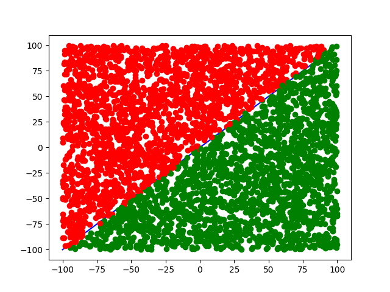

The aims
-----
A Perceptron neronal network coded in C++ and tested on linux machine.
This perceptron will plot dots over a line in green else in red.

To compile those sources:
-----
* clone those sources
* create lib directory at root repo
* clone https://github.com/lava/matplotlib-cpp inside matplotlib-cpp directory:

      mkdir matplotlib-cpp
      cd matplotlib-cpp
      git clone git@github.com:lava/matplotlib-cpp.git
      brew install python-matplotlib

* your source code directory should look like:

```bash
├── build/
├── inc/
│   ├── perceptron.h
│   ├── randomFloat.h
│   └── trainer.h
├── lib/
│   └── matplotlib-cpp/
|     ├── build/
|     ├── cmake/
|     ├── contrib/
|     ├── example/
|     ├── CMakeList.txt
|     ├── matplotlibcpp.h
|     └── README.md
├── src/
│   ├── main.cpp
│   ├── perceptron.cpp
│   ├── randomFloat.cpp
│   └── trainer.cpp
├── CMakeList.txt
└── README.md
```

* create a directory build: 

      mkdir build

* go inside build: 

      cd build

* run cmake: 

      cmake ..

-> it will create all necessary file for cmake

Now to build perceptron:
* run make inside build directory: 

      make

* and launch perceptron: 

      ./perceptron

Configure VSCode to handle build system
-----
* install CMakeTool extension
* launch configuration: `ctrl+shift+p`
* start config: 

      cmake: Configure

=> Will launch the vscode cmake config

Now to compile and run the perceptron, just clic on play button at the bottom of VSCode windows

Result
-----
This perceptron will color the dot over a line in green, and under in red.

To run the perceptron:
`./perceptron "number of point"`
for example, run perceptron over 1000 of points: 
`./perceptron 1000`

Currently, the perceptron is train over number of points argument and after, run the trained perceptron over number of point x by 2

The train process, all points plot during training process:


At perceptron running. Run the perceptron after trainning process over random data:

